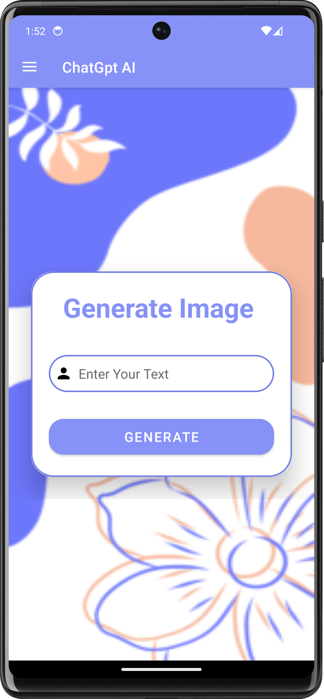

# ChatGptAI

<table>
  <tr>
    <td>Login Page</td>
     <td>Sign Up Page </td>
     <td>Forgot Password Page </td>
  </tr>
  <tr>
    <td valign="top"></td>
    <td valign="top"></td>
    <td valign="top"></td>
   
  </tr>
 </table>
 <table>
  <tr>
    <td>Google SignIn Page</td>
  </tr>
  <tr>
    <td valign="top"></td>
   
  </tr>

 <table>
  <tr>
    <td>ChatGpt Text Page</td>
     <td>Side Navigation</td>
     <td>Image Genration Page </td>
  </tr>
  <tr>
    <td valign="top"></td>
    <td valign="top"></td>
    <td valign="top"></td>
    
   
  </tr>
 </table>

 
 </table>

# Libraries and technologies used
